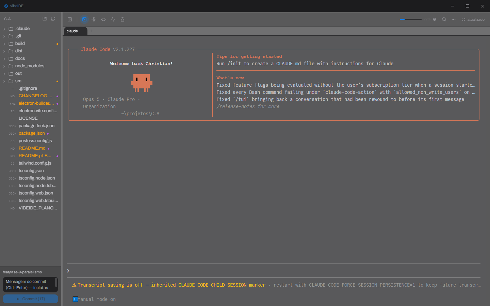
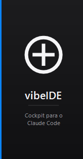
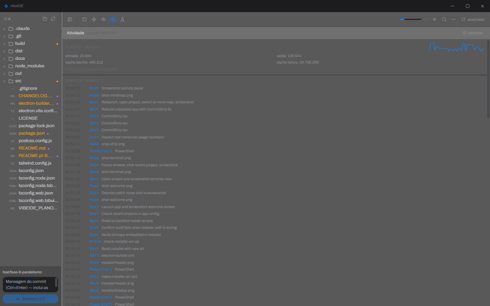
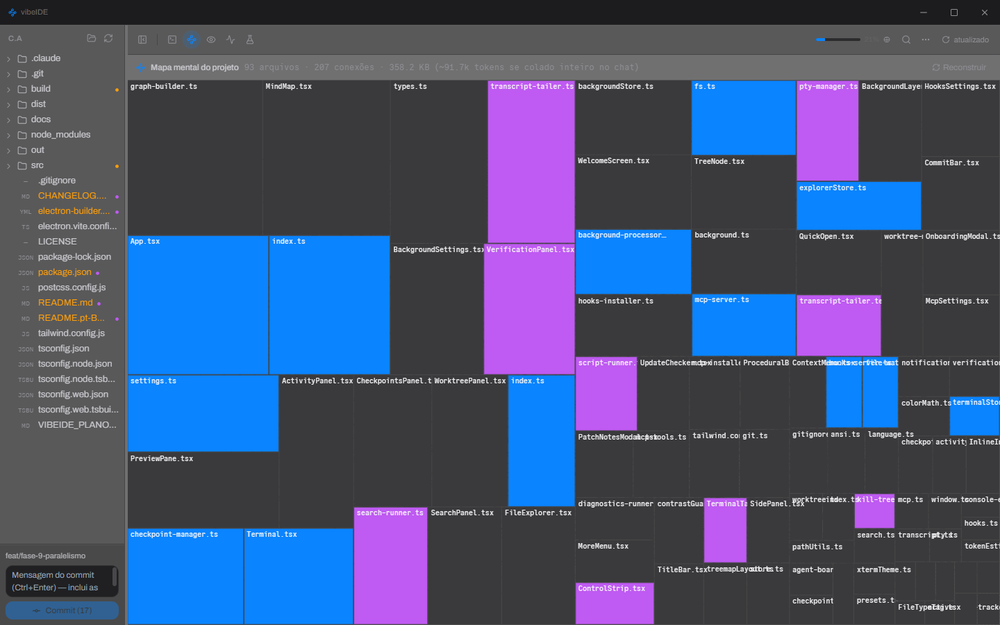

# vibeIDE

*[Leia em português](README.pt-BR.md)*

A desktop cockpit for running [Claude Code](https://claude.com/claude-code). The thesis: the scarce resource in vibecoding isn't tokens, it's supervision — give the human back visibility and control over an autonomous agent.

Built with Electron + React + TypeScript.



## Install (Windows)

Easiest path: grab the ready-made installer, no cloning required.

**[⬇ Download the latest release](https://github.com/ChrisNdev/vibe-ide/releases/latest)** — get `vibeIDE-Setup-x.x.x.exe` from the release assets.

Run the `.exe`, pick an install folder, done — creates a desktop and start-menu shortcut.

The installer carries the app's own visual identity — the art is generated by `build/make-installer-art.ps1`:



### "Windows protected your PC" / antivirus flags it

Not a virus — the installer just isn't **code-signed**. SmartScreen and Defender treat any unknown unsigned executable as suspicious by default, regardless of what it does.

- **SmartScreen** ("Unknown publisher"): click **More info** → **Run anyway**.
- **Defender quarantined it**: use the `vibeIDE-x.x.x-win.zip` from the same release — the whole app without the NSIS installer stub, which is the part heuristics usually flag. Unzip and run `vibe-ide.exe`.
- **Help clear the warning for everyone**: submit the file to [Microsoft Security Intelligence](https://www.microsoft.com/en-us/wdsi/filesubmission) as a false positive.

The actual fix, publisher-side, is signing the executable. The build is already wired for it — with a code-signing certificate, export the env vars before `npm run build:win` and electron-builder signs on its own:

```powershell
$env:CSC_LINK = "C:\path\to\certificate.pfx"
$env:CSC_KEY_PASSWORD = "pfx-password"
npm run build:win
```

Worth knowing: an **OV** certificate signs the binary, but SmartScreen keeps warning until it accrues reputation (weeks of downloads). An **EV** certificate (or Azure Trusted Signing) carries reputation from the first download.

## Features

- **File explorer** — directory tree with on-demand loading, per-file git status (modified/staged/new/etc.), create/rename/duplicate/move/delete, all auto-refreshing via `chokidar`.
- **Real terminal, tabbed** — `node-pty` backed by an actual shell (PowerShell/cmd/bash/WSL, auto-detected), rendered with WebGL (auto-falling back to Canvas or DOM if the GPU can't keep up). Multiple parallel sessions, each tab opens already running `claude`.
- **Parallel tasks via git worktree** — "New task" spins up an isolated worktree at `../.vibe-worktrees/<branch>` and opens a Claude agent there, without touching the main working tree. Per-task status board (running / waiting for input / done) driven by Claude Code hooks. Diff against the current branch, one-click merge, removal only with explicit confirmation.
- **Hooks and notifications** — installs a local hooks server (`PreToolUse`, `Stop`, `Notification`, etc.) via a non-destructive merge into `.claude/settings.json`, with an uninstall that reverts it byte-for-byte. Desktop notification when the agent finishes or needs input, so you don't have to keep the window in view.
- **Activity and cost panel** — reads the Claude Code session transcript straight off disk (never through the AI): tool-call timeline, subagent tree, todo list, tokens/cost per turn, and a browser for past sessions with resume via `claude --resume`.

  
- **Checkpoints** — automatic snapshot via `git commit-tree` (isolated from the real index/HEAD/stash) before every agent edit. Browsable timeline, diff against the current state, restore with explicit confirmation.
- **Internal MCP server** — exposes vibeIDE's own tools (`get_project_graph`, `get_diagnostics`, `get_open_file`, `get_console_errors`) to the Claude running in the terminal, as local context instead of tokens spent grepping the project.
- **Verification panel** — runs `package.json` scripts with ANSI-aware output parsing, detects the dev server's port and embeds a `<webview>` pointed at it, captures console/network errors, and sends the formatted error straight into the agent's terminal with one click. Local `tsc`/eslint diagnostics.
- **Project mind map** — an imposition sheet: rectangles sized by each file's estimated token weight, 1px wires between them. Imports parsed via AST (`oxc-parser`, not regex) with `tsconfig.json` alias resolution, an on-disk cache keyed by mtime, and import-cycle / orphan-file detection. Select files on the map and copy `@path @path` to the clipboard with an estimated token sum — ready-made chat context without grepping anything. 100% local, no AI calls involved.

  
- **Local preview** — click a file in the explorer and its contents show up with line numbers and syntax highlighting, read straight off disk. Diff against HEAD via `simple-git`.
- **Customizable background** — image, gradient, or solid color with an automatic contrast veil; the terminal always stays opaque underneath.
- **Quick commit** — a fixed bar at the bottom of the explorer with the current branch, ahead/behind counters, a message box (`Ctrl+Enter` to commit), and a push button.

## Running from source

For hacking on the code instead of just using the installer. Prerequisites: [Node.js](https://nodejs.org) 18+ and the [Claude Code CLI](https://claude.com/claude-code) installed (it's what the terminal opens running already).

```bash
npm install
npm run dev
```

This builds the main/preload processes, starts Vite in dev mode for the renderer, and opens the Electron window with hot reload.

## Build

```bash
npm run typecheck   # checks main + renderer
npm test            # incremental transcript-reader check
npm run build       # production build (electron-vite)
npm run build:win   # build + NSIS installer for Windows (out/ → dist/)
```

## Architecture

```
src/
  main/       Electron main process — fs, git, pty, worktrees, mind map, window
    ipc/      one handler per domain (fs, git, pty, settings, graph, worktree, ...)
  preload/    contextBridge between main and renderer (contextIsolation + sandbox on)
  renderer/   the React app (explorer, terminal, mind map, preview, panels)
  shared/     types and IPC constants shared across all three worlds
```

All UI ↔ filesystem/git/terminal communication goes through `preload` via `contextBridge` — the renderer runs with `nodeIntegration: false` and `sandbox: true`, no direct Node/Electron access.

## Changelog

See [CHANGELOG.md](CHANGELOG.md).

## License

[MIT](LICENSE)
