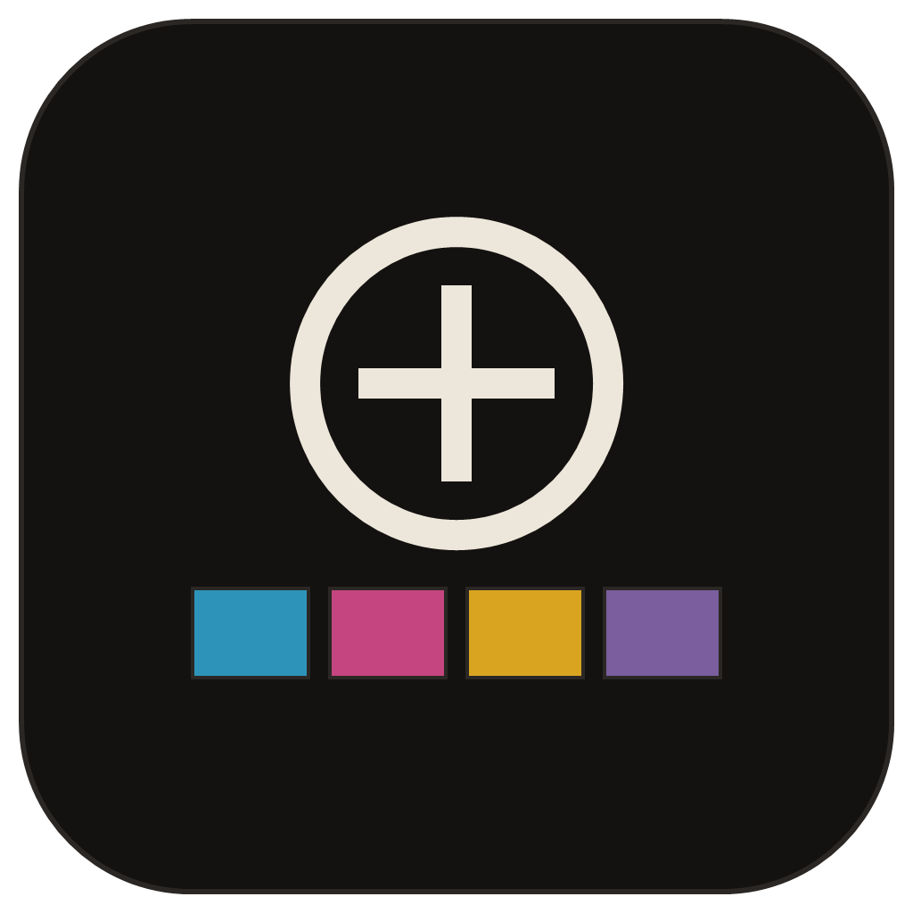
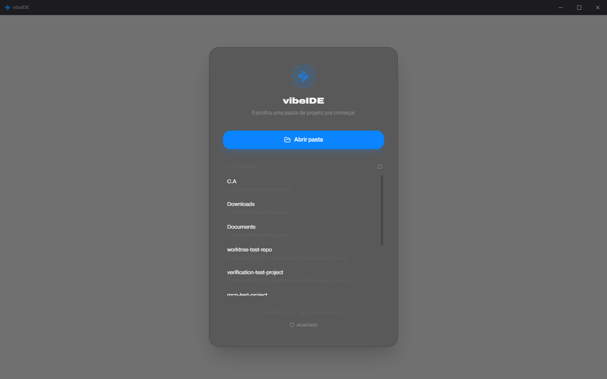
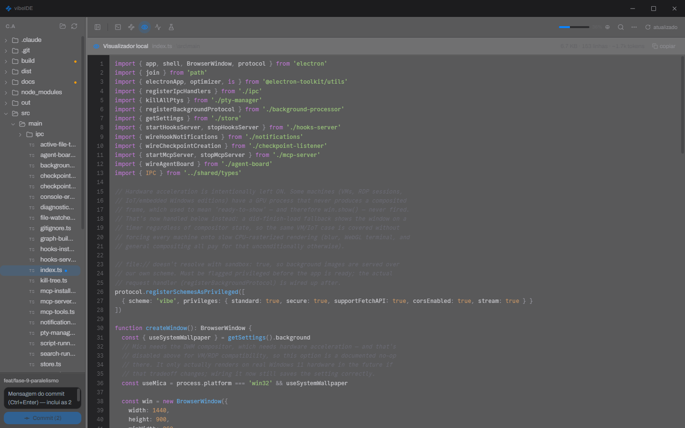
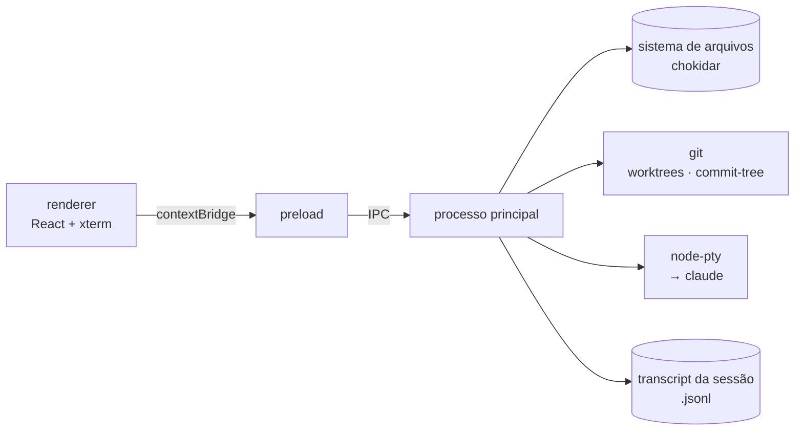

<div align="center">



# vibeIDE

**Cockpit desktop para rodar o [Claude Code](https://claude.com/claude-code).**

O recurso escasso no vibecoding não é token — é supervisão.<br>
Isso devolve ao humano visibilidade e controle sobre um agente autônomo.

[](https://github.com/ChrisNdev/vibe-ide/releases/latest)
[](LICENSE)


*[Read this in English](README.md)*


</div>

---

## Índice

[Instalação](#instalação-windows) · [O que tem dentro](#o-que-tem-dentro) · [Rodando do código-fonte](#rodando-a-partir-do-código-fonte) · [Build](#build) · [Arquitetura](#arquitetura)

## Instalação (Windows)

A forma mais fácil: baixe o instalador pronto, sem precisar clonar nada.

### **[⬇ Baixar a última versão](https://github.com/ChrisNdev/vibe-ide/releases/latest)**

Pegue o `vibeIDE-Setup-x.x.x.exe` nos assets da release, execute, escolha a pasta de instalação e pronto. Cria atalho na área de trabalho e no menu iniciar.

<table>
<tr>
<td width="180" valign="top">

</td>
<td valign="top">

O instalador usa a mesma identidade visual do app — a arte é gerada por `build/make-installer-art.ps1`, então a tela de instalação parece com o que você está instalando, em vez do cinza padrão do NSIS.

</td>
</tr>
</table>

<details>
<summary><b>"O Windows protegeu seu PC" / o antivírus acusa vírus</b></summary>

<br>

Não é vírus — é o instalador não ter **assinatura digital**. O SmartScreen e o Defender tratam todo executável desconhecido e não assinado como suspeito por padrão, independente do que ele faz.

- **SmartScreen** ("Editor desconhecido"): clique em **Mais informações** → **Executar assim mesmo**.
- **Defender colocou em quarentena**: use o `vibeIDE-x.x.x-win.zip` da mesma release — é o app inteiro sem o instalador NSIS, que é justamente a parte que a heurística costuma marcar. Descompacte e rode `vibe-ide.exe`.
- **Quer ajudar a limpar o alerta pra todo mundo**: envie o arquivo em [Microsoft Security Intelligence](https://www.microsoft.com/en-us/wdsi/filesubmission) como falso positivo.

O que resolve de verdade (do lado de quem publica): assinar o executável. O build já está preparado — com um certificado de assinatura de código em mãos, basta exportar as variáveis antes do `npm run build:win` e o electron-builder assina sozinho:

```powershell
$env:CSC_LINK = "C:\caminho\certificado.pfx"
$env:CSC_KEY_PASSWORD = "senha-do-pfx"
npm run build:win
```

Vale saber: um certificado **OV** assina, mas o SmartScreen só para de reclamar depois que o binário acumula reputação (semanas de downloads). Um certificado **EV** (ou o Azure Trusted Signing) já vale reputação desde o primeiro download.

</details>

## O que tem dentro

### Abriu a pasta, o agente já está rodando



Escolhe um projeto e uma aba de terminal abre já rodando `claude` nele. Se a pasta estiver vazia, ele entrega um prompt inicial pro agente em vez de deixar um `claude` pelado esperando você explicar o que acabou de abrir.

- **Terminal real, em abas** — `node-pty` com um shell de verdade (PowerShell/cmd/bash/WSL, detecção automática), renderizado com WebGL e fallback pra Canvas ou DOM se a GPU não aguentar. Múltiplas sessões em paralelo, copiar/colar de verdade, inclusive imagens.
- **Explorador de arquivos** — árvore de diretórios com carregamento sob demanda, status de git por arquivo (modificado/staged/novo/…), criar/renomear/duplicar/mover/excluir, com atualização automática via `chokidar`.
- **Commit rápido** — barra fixa no rodapé do explorador com a branch atual, contadores de commits à frente/atrás do remoto, caixa de mensagem (`Ctrl+Enter` para commitar) e botão de push.

### Ver o que o agente está fazendo de verdade


- **Painel de atividade e custo** — lê o transcript da sessão do Claude Code direto do disco (nunca via IA): timeline de tool calls, árvore de subagents, todo list, tokens/custo por turno, navegador de sessões passadas com retomada via `claude --resume`.
- **Hooks e notificações** — instala um servidor de hooks local (`PreToolUse`, `Stop`, `Notification`, …) via merge não-destrutivo no `.claude/settings.json`, com desinstalação que reverte byte a byte. Notificação desktop quando o agente termina ou precisa de input, sem precisar ficar de olho na janela.

### Entender o projeto sem gastar token


- **Mapa mental do projeto** — folha de imposição: retângulos com área proporcional ao peso em tokens de cada arquivo, arestas como fios de 1px entre eles. Import parseado via AST (`oxc-parser`, não regex) com resolução de alias do `tsconfig.json`, cache em disco por mtime, detecção de ciclo de import e de arquivos órfãos. Seleciona arquivos no mapa e copia `@caminho @caminho` pro clipboard com soma de tokens estimada — contexto pronto pro chat sem grepar nada. 100% local, nenhuma chamada de IA envolvida.



- **Visualizador local (Preview)** — clique num arquivo no explorador e o conteúdo aparece com numeração de linha e realce de sintaxe, lido direto do disco, com o custo estimado em tokens no cabeçalho. Diff contra o HEAD via `simple-git`.

### Rede de segurança e escala

- **Tarefas paralelas via git worktree** — "Nova tarefa" cria uma worktree isolada em `../.vibe-worktrees/<branch>` e abre um agente Claude ali, sem interferir na working tree principal. Board de status por tarefa (rodando / aguardando input / concluído) derivado dos hooks do Claude Code. Diff contra a branch atual, merge com um clique, remoção só com confirmação explícita.
- **Checkpoints** — snapshot automático via `git commit-tree` (isolado do índice/HEAD/stash reais) antes de cada edição do agente. Timeline navegável, diff contra o estado atual, restaurar com confirmação explícita.
- **Painel de verificação** — roda os scripts do `package.json` com parse de output, detecta a porta do dev server e embute um `<webview>` apontando pra ela, captura erros de console/rede, e manda o erro formatado direto pro terminal do agente com um clique. Diagnósticos de `tsc`/eslint local.
- **Servidor MCP interno** — expõe as próprias ferramentas do vibeIDE (`get_project_graph`, `get_diagnostics`, `get_open_file`, `get_console_errors`) pro Claude que roda no terminal, como contexto local em vez de token gasto grepando o projeto.
- **Fundo personalizável** — imagem, gradiente ou cor sólida com véu automático de contraste; o terminal sempre fica opaco por baixo.

## Rodando a partir do código-fonte

Pra quem quer mexer no código em vez de só usar o instalador. Pré-requisitos: [Node.js](https://nodejs.org) 18+ e o [Claude Code CLI](https://claude.com/claude-code) instalado (é o que o terminal já abre rodando).

```bash
npm install
npm run dev
```

Isso builda o processo principal/preload, sobe o Vite em modo dev pro renderer e abre a janela do Electron com hot reload.

## Build

```bash
npm run typecheck   # checa main + renderer
npm test            # checagem do leitor incremental de transcript
npm run build       # build de produção (electron-vite)
npm run build:win   # build + instalador NSIS pra Windows (out/ → dist/)
```

## Arquitetura

```
src/
  main/       processo principal do Electron — fs, git, pty, worktrees, mapa mental, janela
    ipc/      um handler por domínio (fs, git, pty, settings, graph, worktree, ...)
  preload/    ponte contextBridge entre main e renderer (contextIsolation + sandbox ligados)
  renderer/   app React (explorador, terminal, mapa mental, preview, painéis)
  shared/     tipos e constantes de IPC compartilhados entre os três mundos
```



Toda comunicação entre a UI e o sistema de arquivos/git/terminal passa pelo `preload` via `contextBridge` — o renderer roda com `nodeIntegration: false` e `sandbox: true`, sem acesso direto a Node/Electron.

## Changelog

Ver [CHANGELOG.md](CHANGELOG.md).

## Licença

[MIT](LICENSE)
